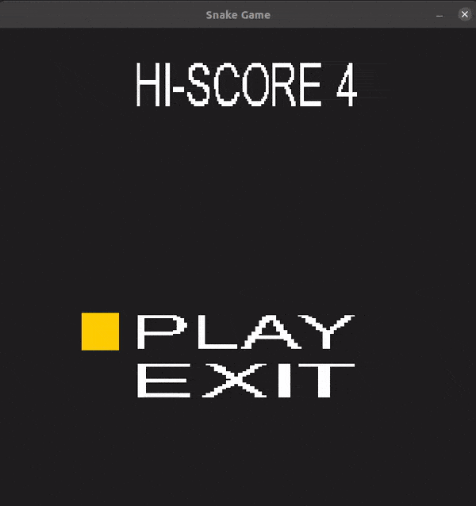

# CPPND: Capstone Snake Game

This repo includes the Capstone project in the [Udacity C++ Nanodegree Program](https://www.udacity.com/course/c-plus-plus-nanodegree--nd213). This repository contains a modified and improved Snake Game project. The code was developed in order to satisfy all criteria for the “README” and “Compiling and Testing” sections in Rubric, and at least 5 total criteria from the rest of the specification.



## Game Description
The game starts from the starting screen. The record score is loaded from file (`/repo/data/record.txt`) and displayed at the top of the window. If the file does not exist, then it will be created. The player can choose to start the game or exit the game. At the end of the game, if the result exceeds the record one, a new record is written to the file (`/repo/data/record.txt`), otherwise nothing happens.
The font from the `/repo/font/arial.ttf` is used to render and draw the menu text.

## Structure
```
CppND-Capstone-Snake-Game/
    ├── CMakeLists.txt          
    ├── demo.gif               
    ├── README.md          
    ├── LICENSE.md           
    ├── data/                   
        └── record.txt          # The file of record result.
    ├── font/                 
        └── arial.ttf           # The font for rendering.
    └── src/
        ├── controller.*        # The Controller class contolls main game and start screen.
        ├── game.*              # Core of logic of the Snake game.
        ├── main.cpp            # game.run() starts game.  
        ├── recordsaver.*       # The manager-class RecordSaver for reading/saving of the record/result.
        ├── renderer.*          # The Renderer class renders of window and has the StartScreen class.
        ├── snake.*             # The Snake class contains logic of the snake.
        └── startscreen.*       # The StartScreen class contains textures of start screen.       
```

## Addressed Points of Project Rubric
### Loops, Functions, I/O
  - The project demonstrates an understanding of C++ functions and control structures. - almost all files, e.g. RecordSaver::Read(int &result);
  - The project reads data from a file and process the data, or the program writes data to a file. - recordsaver.cpp and renderer.cpp:42;
  - The project accepts user input and processes the input. - The enter key is used to start game, controller.cpp:59;
### Object Oriented Programming
  - The project uses Object Oriented Programming techniques. - All files except main.cpp contain classes;
  - Classes use appropriate access specifiers for class members. - All classes have access specifiers;
  - Class constructors utilize member initialization lists. - recordsaver.cpp:3, startscreen.cpp:3, renderer.cpp:9;
  - Classes abstract implementation details from their interfaces. - e.g Read() and Write() methods of recordsaver.cpp;
  - Classes encapsulate behavior. - All classes encapsulate behavior, e.g Renderer::RenderStartMenu(...) of renderer.cpp;
  - Overloaded functions allow the same function to operate on different parameters. - The setters and the getters of startscreen.h;
### Memory Management
  - The project makes use of references in function declarations. - recordsaver.h:13, controller.h:9. It is used for returning value by reference.
  - The project uses scope / Resource Acquisition Is Initialization (RAII) where appropriate. - I wrapped the raw pointers of SDL to smart pointers with a custom deleter, e.g renderer.h:22-23, startscreen.h:21-23 and their constructors.
  - The project uses smart pointers instead of raw pointers.- Also renderer.h:22-23, startscreen.h:21-23 and their constructors.
  

## Dependencies for Running Locally
* cmake >= 3.7
  * All OSes: [click here for installation instructions](https://cmake.org/install/)
* make >= 4.1 (Linux, Mac), 3.81 (Windows)
  * Linux: make is installed by default on most Linux distros
  * Mac: [install Xcode command line tools to get make](https://developer.apple.com/xcode/features/)
  * Windows: [Click here for installation instructions](http://gnuwin32.sourceforge.net/packages/make.htm)
* SDL2 >= 2.0
  * All installation instructions can be found [here](https://wiki.libsdl.org/Installation)
  >Note that for Linux, an `apt` or `apt-get` installation is preferred to building from source. 
* SDL_ttf
  * For Linux
  ```
  sudo apt install libsdl2-ttf-2.0-0
  sudo apt install libsdl2-ttf-dev
  ```
  * Also for other platforms - [releases](https://github.com/libsdl-org/SDL_ttf/releases)
* gcc/g++ >= 5.4
  * Linux: gcc / g++ is installed by default on most Linux distros
  * Mac: same deal as make - [install Xcode command line tools](https://developer.apple.com/xcode/features/)
  * Windows: recommend using [MinGW](http://www.mingw.org/)

## Basic Build Instructions

1. Clone this repo.
2. Make a build directory in the top level directory: `mkdir build && cd build`
3. Compile: `cmake .. && make`
4. Run it: `./SnakeGame`.


## CC Attribution-ShareAlike 4.0 International


Shield: [![CC BY-SA 4.0][cc-by-sa-shield]][cc-by-sa]

This work is licensed under a
[Creative Commons Attribution-ShareAlike 4.0 International License][cc-by-sa].

[![CC BY-SA 4.0][cc-by-sa-image]][cc-by-sa]

[cc-by-sa]: http://creativecommons.org/licenses/by-sa/4.0/
[cc-by-sa-image]: https://licensebuttons.net/l/by-sa/4.0/88x31.png
[cc-by-sa-shield]: https://img.shields.io/badge/License-CC%20BY--SA%204.0-lightgrey.svg
